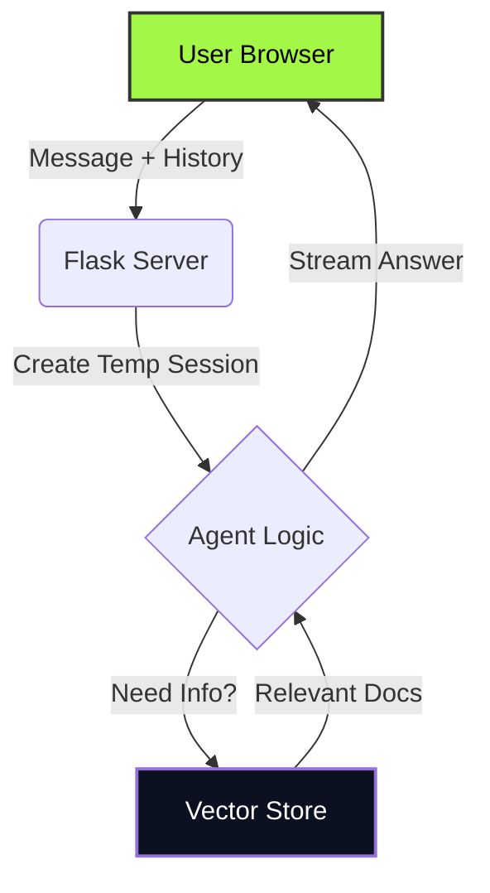

# Modern RAG Chatbot

A powerful Retrieval-Augmented Generation (RAG) chatbot featuring a sleek, responsive dark-themed UI and a privacy-focused stateless backend. Built with Flash, OpenAI Agents, and modern Vanilla JS.


## 🚀 Key Features

### ✨ Modern Frontend
- **Responsive Design**: Mobile-first layout that adapts to any screen size.
- **Sleek Branding**: Deep Navy background with vibrant Lime Green accents.
- **Client-Side History**: Chat history is stored locally in your browser (LocalStorage), so your privacy is respected.
- **Streaming Responses**: Real-time Typewriter effect for AI responses.
- **Loading Animations**: Custom branding animations during processing.

### 🛡️ Secure Backend
- **Stateless Architecture**: The server does not store user sessions or conversation history in a database.
- **RAG Capability**: Uses OpenAI/Gemini vector stores to answer questions based strictly on uploaded documents.
- **Production Ready**: Configured with `gunicorn` and CORS for scalable deployment.

## 🧠 How It Works

The chatbot uses a **Stateless RAG (Retrieval-Augmented Generation)** architecture. Here is the step-by-step flow of every message:

1.  **User Input**: You type a message in the browser.
2.  **Context Assembly (Frontend)**:
    - The `script.js` retrieves the entire conversation history from your browser's `LocalStorage`.
    - It bundles the `current message` + `history` and sends it to the Flask backend.
3.  **Stateless Processing (Backend)**:
    - `main.py` receives the payload.
    - It spins up a **Temporary In-Memory Session** for the agent.
    - It injects the conversation history as context, effectively "reminding" the AI of what was said before.
4.  **Retrieval & Generation**:
    - The **File Retrieval Agent** checks if the user's question requires knowledge from documents.
    - If yes, it queries the **OpenAI/Gemini Vector Store** to find relevant chunks of text.
    - It generates a response strictly based on those documents (Guardrailed to prevent hallucinations).
5.  **Streaming Response**:
    - The answer is streamed back chunk-by-chunk to the frontend.
    - The frontend updates the UI in real-time (typewriter effect) and saves the new answer to `LocalStorage`.



## 🚀 Detailed Features

### 🎨 Frontend Experience
- **Client-Side Persistence**: We use `LocalStorage` to save your chats. This means you can refresh the page or close the tab, and your conversation will be waiting for you. The server never sees your old chats unless you send them providing mapped privacy.
- **Smart Auto-Scroll**: The chat window automatically scrolls to the newest message but intelligently pauses if you are reading older messages.
- **Visual Feedback**:
    - **Loading Spinner**: A crisp white animation indicates when the server is processing.
    - **Markdown Rendering**: Support for nice text formatting (if enabled in future updates).
    - **Clear Chat**: A dedicated trash button to instantly wipe local history.

### 🤖 AI Agent & RAG
- **Strict Retrieval**: The agent is configured with `document_scope_input_guardrail`. It will politely refuse to answer questions not covered by your uploaded documents, ensuring accuracy.
- **Vector Search**: Utilizes high-performance embeddings to find the exact paragraph needed to answer a query.
- **Context Awareness**: Even though the backend is stateless, the Context Injection technique allows the bot to understand follow-up questions like "Tell me more about that".

### ⚙️ Backend Engineering
- **Async Streaming**: Uses Python's `asyncio` and Flask's `stream_with_context` to deliver token-by-token responses, making the bot feel instant.
- **Modular Design**:
    - `main.py`: Handles HTTP/WebSockets.
    - `my_agent.py`: Encapsulates AI logic and Tool use.
    - `my_guardrail.py`: Manages safety and relevance checks.

## 🛠️ Tech Stack

- **Backend**: Python 3.13, Flask, OpenAI Agents, Pydantic.
- **Frontend**: HTML5, CSS3 (Variables & Flexbox), Vanilla JavaScript.
- **Manager**: `uv` for blistering fast dependency management.
- **Deployment**: Ready for Render, Railway, or Vercel.

## 📂 Project Structure

```bash
project-chat-bot/
├── backend/
│   ├── main.py          # Flask entry point & API routes
│   ├── my_agent.py      # OpenAI Agent configuration & stateless logic
│   └── ...
├── frontend/
│   ├── static/          # CSS, JS, Images (Logo, Favicon)
│   └── templates/       # HTML content
├── .env                 # API Keys (Not committed)
├── pyproject.toml       # Dependencies (UV)
├── requirements.txt     # Dependencies (Render/Pip)
└── README.md            # Documentation
```

## ⚡ Quick Start (Local)

### Prerequisites
- Python 3.13+
- [uv](https://github.com/astral-sh/uv) (Recommended) or pip

### Installation

1.  **Clone the repository:**
    ```bash
    git clone https://github.com/your-username/flask-chatbot.git
    cd flask-chatbot
    ```

2.  **Install Dependencies:**
    Using `uv` (Recommended):
    ```bash
    uv sync
    ```
    Or using `pip`:
    ```bash
    pip install -r requirements.txt
    ```

3.  **Configure Environment:**
    Create a `.env` file in the root directory:
    ```env
    OPENAI_API_KEY=sk-...
    VECTOR_STORE_ID=vs_...
    ```

4.  **Run the Application:**
    Using `uv`:
    ```bash
    cd backend
    uv run main.py
    ```
    Or standard python:
    ```bash
    python backend/main.py
    ```

5.  **Open Browser:**
    Navigate to `http://127.0.0.1:5000` to start chatting!

## 🌍 Deployment

### Deploy to Render (Recommended)

1.  **Push to GitHub**.
2.  Create a **New Web Service** on [Render](https://render.com).
3.  Connect your repository.
4.  **Configuration:**
    - **Build Command:** `pip install -r requirements.txt`
    - **Start Command:** `gunicorn --chdir backend main:app`
5.  **Environment Variables:** Add your `OPENAI_API_KEY` and `VECTOR_STORE_ID`.
6.  **Deploy!**

## 🤝 Contributing

1.  Fork the repository.
2.  Create a feature branch (`git checkout -b feature/AmazingFeature`).
3.  Commit your changes (`git commit -m 'Add some AmazingFeature'`).
4.  Push to the branch (`git push origin feature/AmazingFeature`).
5.  Open a Pull Request.

## 📄 License

Distributed under the MIT License.
